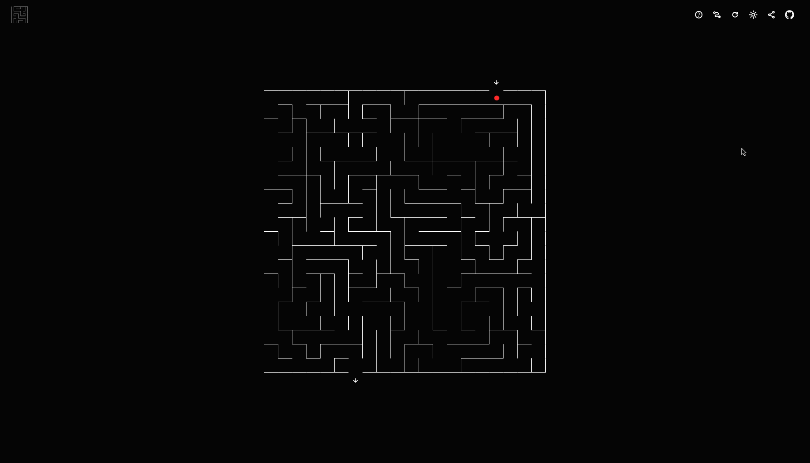

# Amaze

[Amaze](https://chrispyles.io/amaze/) is a small single-page application, written in Angular, for exploring and solving randomly-generated mazes.

Inspired by [this very interesting YouTube video](https://youtu.be/uctN47p_KVk?si=o02IIBBDUa6OYCcs) about mazes.
